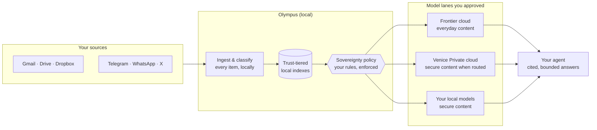
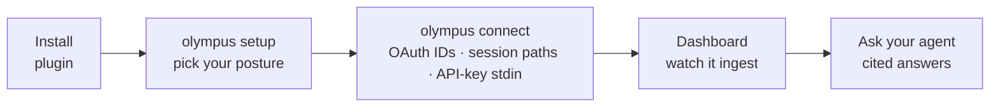

<div align="center">

# ⛰️ Olympus

**Your whole digital life, searchable by your AI — on your privacy terms.**

*A sovereignty-aware source brain for [OpenClaw](https://openclaw.ai) agents.*

[](CHANGELOG.md)
[](LICENSE)
[](CONTRIBUTING.md)
[](https://openclaw.ai)
[](https://bun.sh)

[Quickstart](docs/QUICKSTART.md) · [Release status](docs/V0_4_RELEASE.md) · [Source capabilities](docs/SOURCE_CAPABILITIES.md) · [How it works](#how-it-works) ·
[Sources](#supported-sources) · [Security model](#the-security-model) ·
[Commands](#command-reference)

</div>

---

> **🤖 Installing this as an AI agent?** Stop and read
> **[INSTALL_FOR_AGENTS.md](INSTALL_FOR_AGENTS.md)** before running any
> command — it is the step-by-step runbook you must follow, including
> exactly what to tell your operator after each step (your install report
> must end with the Step 1→2 invitation, never a bare status line). Managed
> `git:`, `clawhub:`, and `npm-pack:` installs intentionally hide their internal
> package path; use the installed `olympus` CLI and this packaged runbook rather
> than searching OpenClaw's managed storage.

---

Personal AI becomes genuinely useful when it can reason across your whole
life — email, messages, files, notes, reading. It becomes **trustworthy**
when *you* decide which models are allowed to see which parts of it.

Olympus is both. It ingests your sources into local, trust-tiered indexes,
then lets your frontier agent answer questions across all of them — with
sensitive material handled only by lanes you approved: your own local models,
privacy-approved private cloud inference, or not at all.

```text
you › "What did I commit to this week, across email and Telegram?"

agent › Three commitments: the tax documents to Maria by Friday
        (email, Tue), reviewing the lease amendment (email, Mon),
        and the Saturday ride logistics (Telegram, Wed). [3 citations]
```

Your agent saw a bounded, cited, policy-gated answer. It never saw your
mailbox.

## How it works

Every item you ingest is classified as public, private, secure, or secrets
(internally S0-S5), and every tier
routes only to the model lanes your sovereignty policy allows:



Four postures, chosen (and changeable) in setup — a config file, not a code
fork:

| Preset | Public/private content | Secure content: health, finance, legal, therapy, family |
|---|---|---|
| **Local models and private cloud** (`local-first`) | frontier cloud | approved secure pool with explicit local → [Venice](https://venice.ai) Private order |
| **Local models only** (`local-only`) | frontier cloud | your own local models only |
| **Private cloud only** (`private-cloud-only`) | frontier cloud | [Venice](https://venice.ai) Private model (`kimi-k3`) |
| **Do not add secure data to Olympus** (`no-sensitive`) | frontier cloud | **not ingested** — reported as an honest gap |

Some rules are not configurable, by design: secure content never routes to
ordinary cloud models, secrets are denied to every lane, and an
exhausted policy chain refuses rather than silently downgrading.

## Get started

**You need** OpenClaw `2026.7.1+` on a Node release OpenClaw itself supports
(`>=22.22.3 <23`, `>=24.15.0 <25`, or `>=25.9.0` — its installer refuses any
other), plus [Bun](https://bun.sh) `1.2+`. macOS or Linux.

The pilot uses the exact qualified `olympus-0.4.0.tgz` supplied by the
maintainer, together with its SHA-256 and byte count. Let your agent do the
install. Give it those files and paste this into any agent with a terminal
(OpenClaw, Claude Code, Codex):

> Verify the supplied Olympus tarball against its SHA-256 and byte count.
> Read `package/INSTALL_FOR_AGENTS.md` from that archive and follow it step by
> step, including the existing-install check before installing. Use those exact
> package bytes and record their identity in the install report.

`openclaw plugins install clawhub:olympus` becomes the one-line public path
once Olympus is published to ClawHub, which happens **after** the pilot. The
pilot and release qualification both use the managed `npm-pack:` path — see
[docs/V0_4_RELEASE.md](docs/V0_4_RELEASE.md). A Git checkout or rebuilt package
does not qualify the supplied candidate.

`--accept-capabilities` is required by OpenClaw `2026.8.1+`: an agent-driven
install is non-TTY, and without the flag the host exits 1 asking for capability
consent it cannot prompt for. Omit the flag on `2026.7.1`, which does not
define it.

The agent checks prerequisites, installs the plugin, helps you describe your
data as a sensitivity map, asks for your privacy posture, connects your keys
without logging them, and verifies the install end to end. About ten minutes
plus OAuth clicks.

Prefer to drive it yourself? Follow **[docs/QUICKSTART.md](docs/QUICKSTART.md)**,
starting with the archive identity and existing-install checks. Its install
command for a clean machine is:

```bash
openclaw plugins install npm-pack:/absolute/path/to/olympus-0.4.0.tgz --force --accept-capabilities
# On OpenClaw 2026.7.1, omit both flags for a clean install.
# On newer hosts, --force also overwrites an existing plugin: check first.
openclaw plugins enable olympus
OLYMPUS_ROOT="$(openclaw plugins inspect olympus --json | jq -r .plugin.rootDir)"
OLYMPUS_BIN="$OLYMPUS_ROOT/bin/olympus"
"$OLYMPUS_BIN" doctor
```

Continue the quickstart to describe your data, choose a privacy posture,
connect credentials, and verify a cited answer. The CLI lives inside the
managed plugin; use the resolved executable rather than assuming it is on PATH.

For Gemini embeddings, Venice accounts/API credit, or local models, use the
[agent-led model setup guide](docs/SOVEREIGNTY_CONFIG.md#agent-led-model-setup-for-the-v04-beta).
It explains the separate secure/non-secure routes and the current dimension
configuration blocker before you connect keys or restart.

## Supported sources

| Source | Connect flow | Notes |
|---|---|---|
| Gmail | browser OAuth | one account in v0.4 |
| Google Drive | browser OAuth | docs + files |
| Dropbox | browser OAuth | full file spine: metadata, extraction, OCR |
| Telegram | guided phone login | forward sync of active chats |
| WhatsApp | QR pairing | live bridge |
| X bookmarks | browser OAuth with a user-owned developer app | folder provenance and provider cost ceilings |
| Readwise | API key | optional |

Model-lane credentials such as Venice are security-preset prerequisites, not
source connectors. Domain-agent imports and other source families are outside
the v0.4 public roster.

Tokens live in an encrypted local secret store by default, or in an explicitly
configured OS/1Password secret store when supported, never in plain text.
Ingestion, classification, and indexing all run in one supervised local
worker — `olympus worker install` makes it start on login. All seven declared
sources sync through the canonical connector-store runtime; v0.4 supports one
connected account per provider. Dashboard onboarding now presents one explicit
seven-stage journey from security preset through cited-answer readiness, with
the next supported action on every blocked or degraded source. Clean-install
and real-provider qualification remain Slice 4 work, not alternate ingestion
paths.

On an existing live OpenClaw install, treat plugin install/enable, gateway
restart, worker service changes, and plugin refresh as live-system changes:
validate with `openclaw config validate` and `openclaw doctor --lint`, then
restart only through `openclaw gateway restart` or the documented ops refresh
script. The repo docs and commands should never require raw edits to
OpenClaw runtime config.

## The security model

Olympus is built on the assumption that the boundary *is* the product:

- **Local-first ingestion.** Raw source content lands in local SQLite
  indexes before any model sees anything. Classification happens at home.
- **Sanitized handoffs.** Agents receive answer text, citations, and audit
  counts — typed wire shapes with `raw_source_exposed: false`, re-validated
  client-side. Raw documents, embeddings, cursors, and tokens never cross.
- **A hard membrane.** Any evidence pack containing sensitive material is
  barred from standard cloud lanes by two independent checks — policy
  validation at config load, and a runtime re-check on every request.
- **Fail closed, everywhere.** No approved lane for a tier means a refusal
  with an honest error — never a silent fallback to a less-trusted model.
- **Authenticated by default.** The worker binds loopback with bearer-token
  auth on every route; new installs generate the token during setup. Browser
  controls exchange it for a short-lived HttpOnly local session protected by
  same-origin and CSRF checks; the bearer is never stored by the page.
- **A real exit.** `olympus data export` gives you your data;
  `olympus data delete --all` verifiably removes indexes, embeddings,
  configs, tokens, and service units.

The onboarding flow, end to end:



## Command reference

| Command | What it does |
|---|---|
| `olympus setup --preset <preset> --yes` | writes sovereignty policy and worker auth for the chosen posture |
| `olympus connect <source> ...` | records OAuth, session, or API-key credentials with source-specific flags |
| `olympus worker foreground\|install\|start\|stop\|restart\|status\|upgrade\|uninstall` | one versioned lifecycle for the local engine, foreground or supervised |
| `olympus dashboard` | opens the local ingestion dashboard |
| `olympus dashboard token` | prints the worker token the dashboard's Unlock field asks for |
| `olympus source answer "…"` | ask across your sources from the terminal |
| `olympus doctor` | diagnoses problems, each with a fix-it hint |
| `olympus data export\|delete` | your data, out — or gone |
| `olympus serve` | MCP stdio server for non-OpenClaw agents |

`olympus worker install` and `upgrade` atomically reconcile the generated
service unit and owner-only worker environment before activation. Interrupted
install or upgrade transactions recover the previous managed files when the
same command is rerun. `status` reports the observed service and transaction
state; it never guesses that an unreadable manager or non-regular managed path
is healthy. `uninstall` removes only the supervised service and intentionally
retains credentials, source configuration, and indexed data. Use the separate
data lifecycle when those bytes should also be removed.

Credential, scope, pairing, Disconnect, partial-sync, and source-dependency
repairs do not normally require a worker restart. Follow the source card or
`olympus doctor` recovery action instead.

Dashboard **Disconnect** stops new scheduled and manual reads, removes the
selected local account grant, and keeps indexed data and reusable developer-app
registration. It does not revoke provider-side access; the card links the
provider revocation page. Local data deletion remains the deliberate CLI-only
flow: preview `olympus data delete --source <id> --dry-run`, Disconnect the
source, then run the command without `--dry-run`.

Telegram and WhatsApp are paired sessions rather than broker grants, so their
cards carry **Unpair** instead: it stops new reads and deletes this computer's
pairing session, keeping indexed messages and captured media, and leaves the
linked device in place at the provider for you to remove there.

### Using Olympus from other agents (MCP)

`olympus serve` exposes the same sanitized read operations — `source_answer`,
`source_index_status`, and capability-gated `source_index_search` — to any
MCP-capable agent. The supported v0.4 Hermes configuration narrows that server
to exactly `source_answer` and `source_index_status` through its per-server
tool allowlist.

For Hermes Agent, resolve the installed plugin first:

```bash
openclaw plugins inspect olympus --json
```

Copy `plugin.rootDir` from that content-free response, append `/bin/olympus`,
and pass the resulting absolute executable path to Hermes:

```bash
hermes mcp add olympus --command /absolute/managed/olympus/bin/olympus --args serve
hermes mcp test olympus
```

Make the `olympus` server entry in `~/.hermes/config.yaml` match the packaged
[`config/hermes/olympus.mcp.yaml`](config/hermes/olympus.mcp.yaml):

```yaml
mcp_servers:
  olympus:
    command: <absolute-managed-plugin-root>/bin/olympus
    args: [serve]
    tools:
      include: [source_answer, source_index_status]
      prompts: false
      resources: false
```

Restart Hermes or run `/reload-mcp`, then verify that the discovered registered
names are exactly `mcp_olympus_source_answer` and
`mcp_olympus_source_index_status`. Invoke the discovered names rather than
hard-coding them. A cited-answer round trip uses the discovered
`mcp_olympus_source_answer`; `source_watch_*` remains OpenClaw-only.

The optional packaged Hermes skill is
[`integrations/hermes/ask-sources/SKILL.md`](integrations/hermes/ask-sources/SKILL.md).
Copy its directory to `~/.hermes/skills/ask-sources/` or expose the parent with
`skills.external_dirs`; it declares the same two tools and no fallback access.

No `hermes://mcp/install` link is published: current Hermes upstream documents
custom MCP installation through `hermes mcp add` but does not document that URI
handler. No Nous catalog submission has been made; that remains a later,
separately reviewed external action.

Operator surfaces (sync, export, transcription, promotion) stay hidden unless
their explicit admin gates are enabled, and worker bearer auth is enforced
throughout.

Operational note for connector-store corpora: run the matching sync script
first, then mount the same SQLite store in the source worker with
`OLYMPUS_SOURCE_INDEX_CONNECTOR_STORES_JSON`. The worker env entry must use
the same corpus id, `family`, `trustDomain`, and `dbPath` the sync script
writes, and that corpus id must be in the corpus registry — a store mounted
for an unregistered corpus fills but is never read.

Chat-family mounts must also declare their exact principal identity with
`principalProvider` and `principalAccountScope` (for example, `whatsapp` and
`personal`). Structured scopes use the stored account scope as their prefix, so
the shipped WhatsApp identity is `personal:chat:<id>` while Telegram remains
`telegram.personal:chat:<id>`. A chat mount without both fields remains
available for non-`chat_scope` reads, but `chat_scope` filtering fails closed
as not configured; mounted rows never establish account authority.

The migration-era indexes, replay/import utilities, read-authority switches,
and retired store writers were removed in Slice 2. Canonical connector stores
are now the only source read/write authority. Compatibility aliases that
remain at input boundaries do not select another runtime or store.

## Development

Olympus is TypeScript on Bun: one plugin package, stable versioned architecture
contracts (`SourceConnector` / `EvidencePack` / `Analyst` — only the
connector is per-source), and 1,400+ tests including an architecture guard
that keeps per-source answer logic out of the shared spine.

```bash
bun install
bun run test:focus -- test/example.test.ts
```

Use focused local proof while editing; GitHub requires each substantive CI lane
and runs the complete suite in parallel before merge. See the canonical
[engineering process](docs/ENGINEERING_PROCESS.md).

Deep-dive docs: [contracts and architecture](docs/CONTRACTS.md) ·
[trust model](docs/TRUST_MODEL.md) · [sovereignty config](docs/SOVEREIGNTY_CONFIG.md) ·
[uninstall](docs/UNINSTALL.md)

## License

[MIT](LICENSE) — free for any use, including commercial.

Want to suggest a change? See [CONTRIBUTING.md](CONTRIBUTING.md): fork,
branch, open a PR. Read access doesn't include direct pushes — everything
lands through review.
