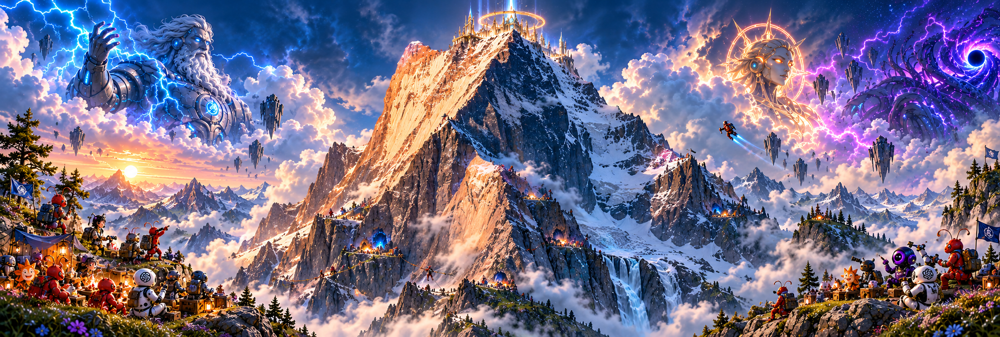
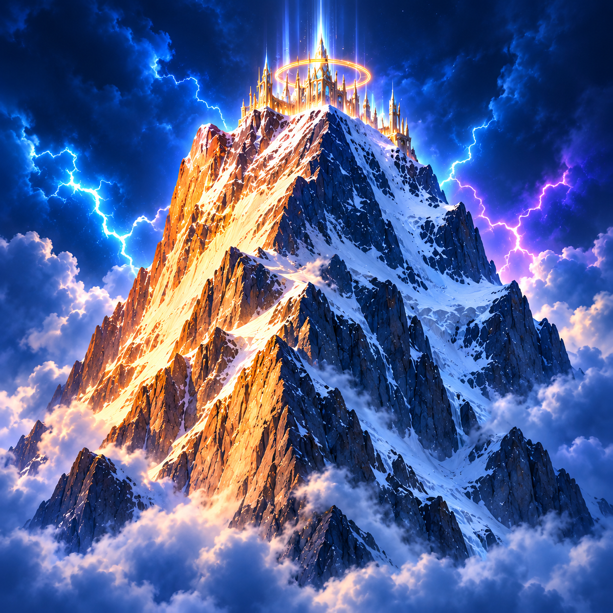
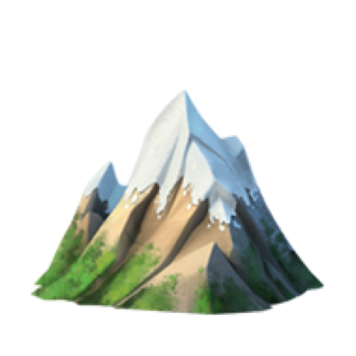

# Olympus brand assets

| Asset | Size | Use |
| --- | --- | --- |
| [Banner](banner.png) | 2157 × 729 PNG | Approved panoramic mountain artwork, also used in the repository README. |
| [Square mountain](mountain-square.png) | 1254 × 1254 PNG | Approved detailed mountain portrait with the gold-lit face, snowy summit, and Olympus palace. |
| [Mountain emoji](mountain-emoji.png) | 512 × 512 RGBA PNG | Transparent mountain emoji, matching the current plugin icon. |

The banner and square mountain are the approved generated artwork. The emoji
is a copy of the existing `assets/icon.png`. The runtime assets remain at
`assets/olympus-banner.png` and `assets/icon.png`; this folder collects the
brand artwork for reuse.

## Banner

## Square mountain

## Mountain emoji

